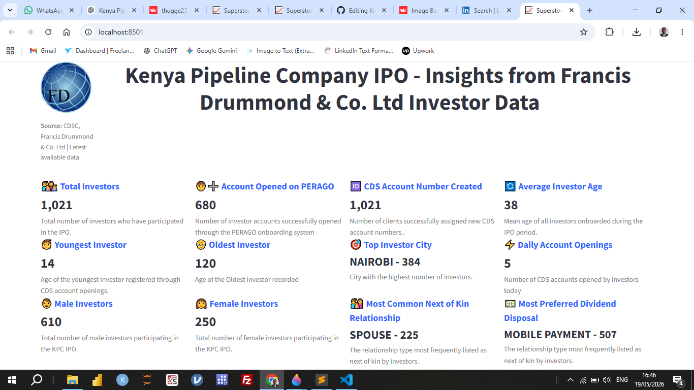
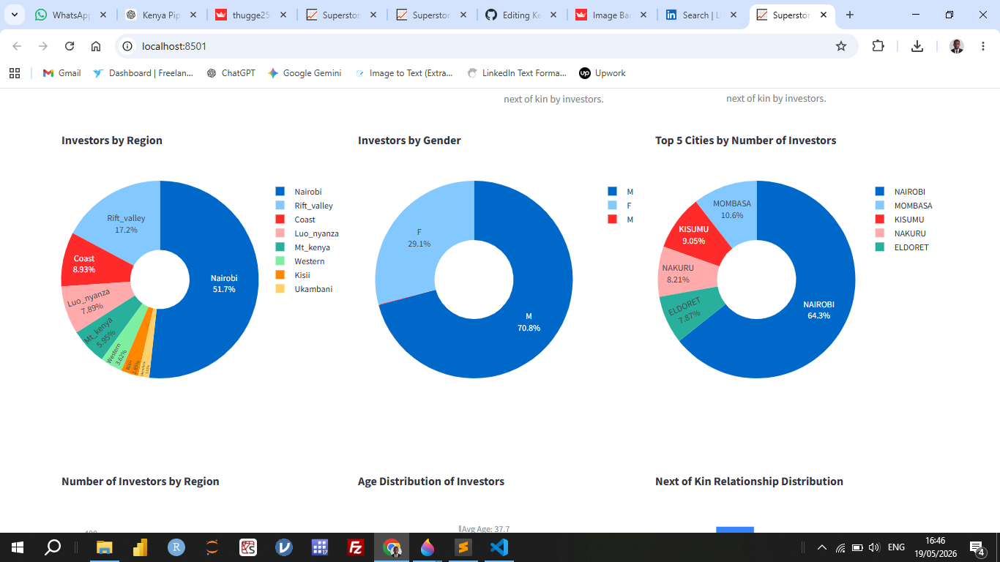
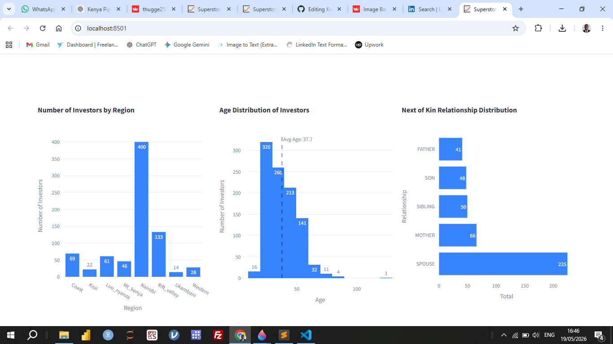
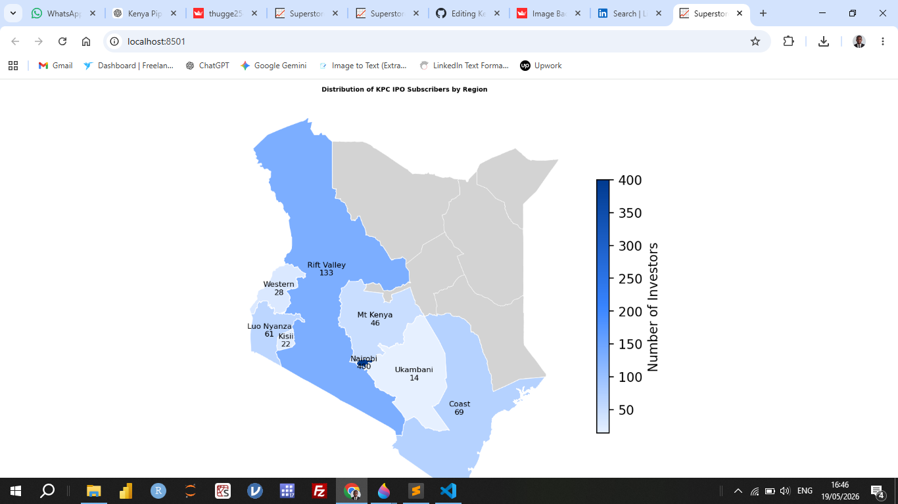

# 🇰🇪 Kenya Pipeline Company IPO – Investor Insights Dashboard

An interactive data analytics dashboard built to explore investor behavior, demographics, and IPO subscription patterns for the **Kenya Pipeline Company IPO**, using investor data from Francis Drummond & Co. Ltd.

The dashboard provides a comprehensive view of investor participation across Kenya, helping uncover insights into onboarding efficiency, regional distribution, and demographic trends.

### 📊 Project Overview

This project analyzes IPO investor data to answer key business questions such as:

- Who are the investors participating in the IPO?
- How are investors distributed across regions and cities?
- What are the demographic characteristics of investors?
- How efficient is the investor onboarding process?
- What are the preferred dividend disposal methods?

### 📈 Key Features
**KPI Dashboard**
- Total Investors
- Accounts Opened on PERAGO
- CDS Account Numbers Created
- Average Investor Age
- Youngest & Oldest Investor
- Most Preferred Dividend Disposal Method
- 
### 📊 Visual Analytics
**Donut charts for:**
- Gender distribution
- Regional investor distribution
- Histogram of investor age distribution
- Bar chart of investors by region
- Top 10 cities by number of investors
  
### 🗺️ Geographic Insights
Interactive Kenya map showing IPO subscription distribution across regions/counties

### 🛠️ Tech Stack
**Python**
**Pandas** – data cleaning & manipulation
**Plotly** – interactive visualizations
**Streamlit** – dashboard development
**GeoPandas / GeoJSON** – geographic mapping

## 📷 Dashboard Preview

### 📊 KPI Dashboard

### 🍩 Donut Charts

### 📈 Distribution Charts

### 🏙️ IPO Subscription Map

### 🚀 Getting Started
**1. Clone the repository**
`git clone https://github.com/your-username/kpc-ipo-dashboard.git
cd kpc-ipo-dashboard`

**2. Install dependencies**
`pip install -r requirements.txt`

**3. Run the dashboard**
`streamlit run app.py`

### 📁 Project Structure
`├── app.py
├── data/
│   └── investor_data.csv
├── assets/
│   └── images/
├── requirements.txt
└── README.md`
